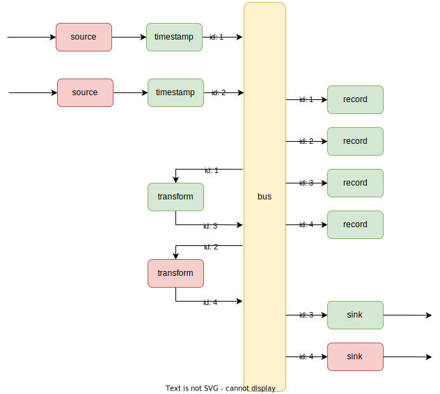

# porla
**P**ipeline-**O**riented **R**eal-time **L**ogging **A**ssistant or simply a basic toolbox for handling of line-based streaming data using linux pipes and some handy command-line utilities

> "porla" is also a Swedish word for the soothing sound of running water from a small stream of water

## Motivation and purpose

TODO

## Overview

### Schematic



### Tech stack

TODO

### Performance

TODO

## Usage

It is packaged as a docker image, available here: https://github.com/orgs/MO-RISE/packages

The image expects a "run" command inputted on startup. Using docker run, this would manifest as such:
```
docker run --network=host porla "<command>"
```

Using docker-compose it would look like this:
```
version: '3'
services:
    service_1:
        image: ghcr.io/mo-rise/porla
        network_mode: host
        restart: always
        command: ["<command>"]
```

### Built-in functionality

* **to_bus** and **from_bus**

  Pipes data to or from the `bus`. Expects a single argument, the `bus_id`.

* **record**

  Records (appends) data from STDIN to a file. Expects a single argument, the `file_path`.

* **b64**

  Base64 encodes (`--encode`) or decodes (`--decode`) data from STDIN to STDOUT.

* **jsonify**

  Parses each line according to a `parse` format specification (see https://github.com/r1chardj0n3s/parse#format-syntax). Expects a single argument, the `format specification`.

* **timestamp**

  Prepends a timestamp  to each line. The timestamp is either the unix epoch (`--epoch`) or in rfc3339 format (`--rfc3339`)

* **shuffle**

  Rearrange, deduct or add content to each line using two (one for the input and one for the output) format specifications. Expects two arguments, the `input_format_specification` and the `output_format_specification`.

* **limit**

  Rate limit the flow through a pipe on a line-by-line basis. Expects a single required argument, `interval`, and an optional argument, `--key` with a format specification of how to find the key of each line whereby to "group" the flow.

### 3rd-party tools

* **socat**

  https://linux.die.net/man/1/socat

### Examples

```yaml
version: '3.8'

services:
    source_1:
        image: ghcr.io/mo-rise/porla
        network_mode: host
        restart: always
        command: ["socat UDP4-RECV:1457,reuseaddr STDOUT | timestamp | to_bus 1"]

    transform_1:
        image: ghcr.io/mo-rise/porla
        network_mode: host
        restart: always
        command: ["from_bus 1 | jsonify '{} {name} {value}' | to_bus 2"]

    transform_2:
        image: ghcr.io/mo-rise/porla
        network_mode: host
        restart: always
        command: ["from_bus 2 | b64 --encode | to_bus 3"]

    sink_1:
        image: ghcr.io/mo-rise/porla
        network_mode: host
        restart: always
        command: ["from_bus 3 | socat STDIN UDP4-DATAGRAM:1458"]

    record_1:
        image: ghcr.io/mo-rise/porla
        network_mode: host
        restart: always
        volumes:
            - ./recordings:/recordings
        command: ["from_bus 1 | record /recordings/bus_id_1.log"]

    record_2:
        image: ghcr.io/mo-rise/porla
        network_mode: host
        restart: always
        volumes:
            - ./recordings:/recordings
        command: ["from_bus 2 | record /recordings/bus_id_2.log"]

    record_3:
        image: ghcr.io/mo-rise/porla
        network_mode: host
        restart: always
        volumes:
            - ./recordings:/recordings
        command: ["from_bus 3 | record /recordings/bus_id_3.log"]

```

## Extensibility

Build a docker image using the `porla`image as the base image and add any required binaries. Name the docker image `porla-<extension_name>`.

For examples, see https://github.com/topics/porla-extension
